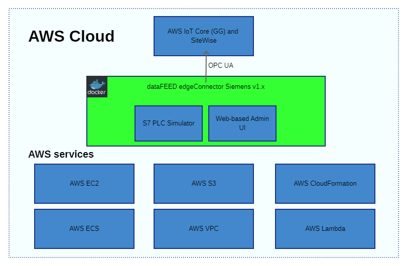
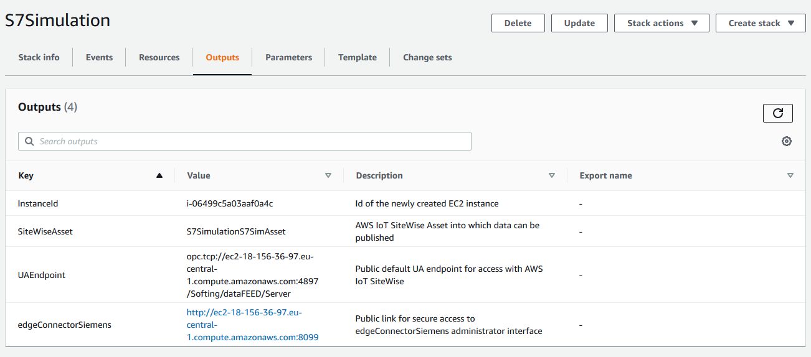
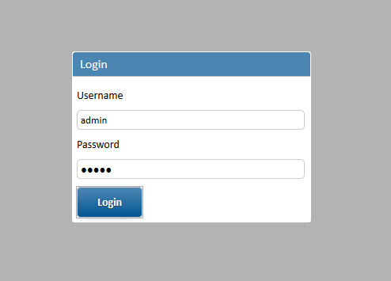
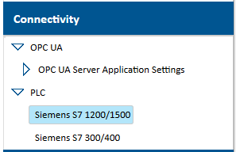
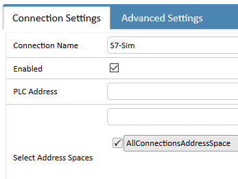
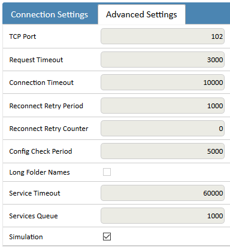
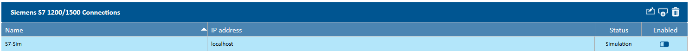
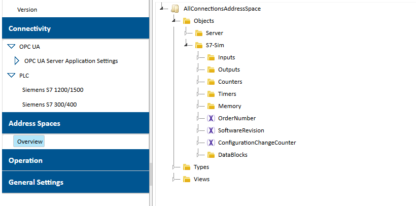
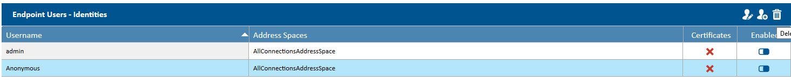
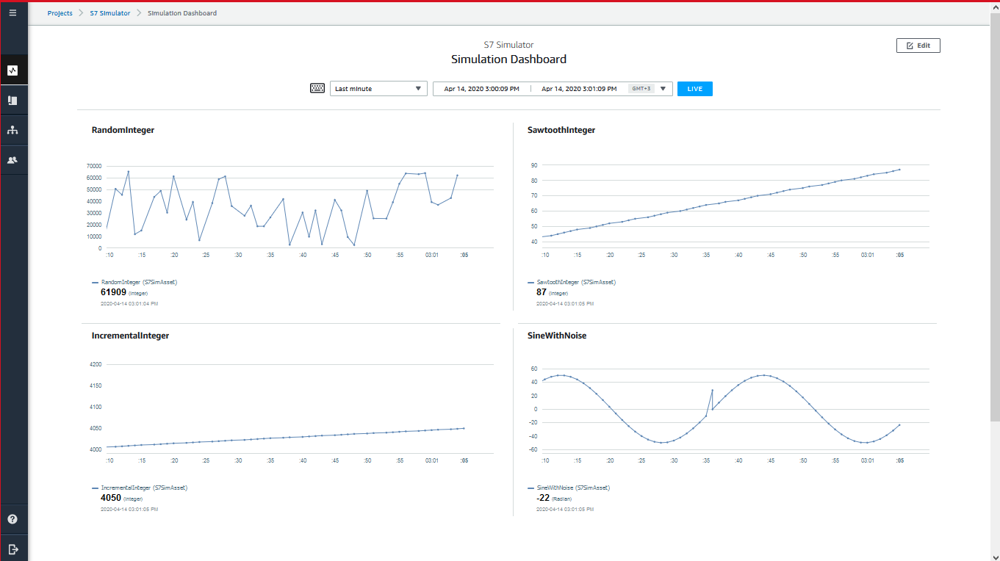

# Softing edgeConnector Siemens AWS QuickStart with S7-2 protocol Simulator

## Definition
An AWS QuickStart is "[...] built by AWS solutions architects and partners to help you deploy popular technologies on AWS, based on AWS best practices for security and high availability. These accelerators reduce hundreds of manual procedures into just a few steps, so you can build your production environment quickly and start using it immediately.
Each Quick Start includes AWS CloudFormation templates that automate the deployment and a guide that discusses the architecture and provides step-by-step deployment instructions." -- as defined by AWS.

## Goal

The goal is to create a fully virtual setup, by providing AWS infrastructure and service resources needed to run the Softing edgeConnector Siemens with the Simulator functionality on the AWS Cloud platform. This setup requires the edgeConnector Siemens product to be fully independent of any on-premise configuration of any PLCs or data sources, so that the user can easily deploy it in their own AWS account for evaluating. Thus, the S7-2 protocol simulator module was built, included in with data simulation/generation capabilities.

[AWS CloudFormation](https://aws.amazon.com/cloudformation/) is the used to automate this setup, which adheres to the IaaS (infrastructure as a service) cloud model. It allows to descriptively specify the definitions of the necessary cloud resources and services to build a software stack from ground up, either in a fully cloud-hosted or hybrid structure. It uses templates to realize this, written in either JSON or YAML, and is able to automatically provision what they contain.
It allows for a very fine-grained specification to be implemented, as we aim for a more minimal setup.

## Architecture

The architecture proposed for the QuickStart package is the following, along with the most important AWS services listed:

### Components
We use and create the following components for this end-to-end solution:
 - **[Softing edgeConnector Siemens with the Simulator](https://hub.docker.com/r/softingindustrial/edgeconnector-siemens)** functionality, in Docker container format (click link to see description from Docker Hub or documentation [here](https://github.com/SoftingIndustrial/datafeed-edge-connector/blob/master/edgeconnector-siemens/README.md))
 - an AWS **EC2 virtual machine** on which AWS IoT Greengrass and the edgeConnector can run (t2.micro, different Amazon Linux AMIs per region are used)
 - a standard **AWS VPC** configuration with one **subnet** with internet access so that AWS IoT SiteWise and other UA clients can access the UA server made public by the edgeConnector
 - AWS **ECS configuration** and instructions for how to start the edgeConnector, including open ports, number of instances, availability of load-balancing, necessary **cluster/service/task definition** configurations, all needed to automatically deploy the edgeConnector on the EC2 instance
 - a number of **custom Lambda functions** created specifically for the provisioning and deleting of AWS IoT SiteWise Asset Models and Assets, as well as asset measurement to UA tag mappings, so that simulated PLC data can flow from the edgeConnector to AWS IoT SiteWise; some more Lambda functions are used for creating Greengrass resources, but they are inline in the CloudFormation template
 - a public AWS **S3 bucket** for storing these Lambda functions in a zip file
 - a **username/password** secret pair in SecretsManager used for loging in to the edgeConnector UA server; this secret is used also by IoT Greengrass/SiteWise to connect

For a more detailed view of all the components please check the CloudFormation template.

> Note: For changing and adapting the template more technical experience with CloudFormation and the listed service categories is required.

In order to deploy the QuickStart the following requirements need to be satisfied and steps to be taken.

### Prerequisites:
 - an **AWS account**, with permissions to use the services mentioned above, including AWS IoT Core and AWS IoT Greengrass, which are prerequisites for AWS IoT SiteWise, thus not shown in the diagram
 - **AWS SSO**: in order to be able to visualise data sent to AWS IoT SiteWise by using its monitoring capabilities (portals and dashboards), the destination AWS account needs to have SSO sign-in capabilities. This is also required if the data is going to be visualised by non-AWS users and accounts. We leave these types of configurations to the user, the CloudFormation template does not provide such configuration
 - AWS IoT **Greengrass service role** with the right permissions: we need the standard (_AWSGreengrassResourceAccessRolePolicy_) access policy for the Greengrass service role as described [here](https://docs.aws.amazon.com/greengrass/latest/developerguide/service-role.html#manage-service-role-console), containing permissions to use secrets. If you already have one set up for your account, but without the mentioned policy, a new role will be created and attached with the necessary policy, replacing the existing one. Also, if there is no service role set, a new one will be created and set for the account.  
 The Greengrass service role is necessary to allow Greengrass deployments to work with other AWS services; in our case one of them is SecretsManager, in which we store a pair of username and password for the edgeConnector Siemens UA endpoint. Greengrass and SiteWise need to be able to retrieve this information from SecretsManager.
 - **Supported regions**, due to Greengrass and SiteWise availability: check [here](https://docs.aws.amazon.com/iot-sitewise/latest/userguide/getting-started.html#requirements) to see the availability.
 - **Optional**:  
    A. we do not include an EC2 key pair for the EC2 machine that is used, for simplicity, so you may need to create one yourself if you need internal access to it. See [here, Option 1](https://docs.aws.amazon.com/AWSEC2/latest/UserGuide/ec2-key-pairs.html) how to create a key pair to be used with the EC2 machine. Also, you will need to modify the CloudFormation template we provide to use EC2 key pairs.

    To achieve that you need to modify the template in two places:

    1. In the _Parameters_ section, before the _InstanceType_ parameter add the following:

                "KeyName": {
                    "Description": "Name of an existing EC2 KeyPair to enable SSH access to the EC2 instance",
                    "Type": "AWS::EC2::KeyPair::KeyName",
                    "ConstraintDescription": "Must be the name of an existing EC2 KeyPair."
                },

    2. In the _EC2Instance_ section find the _Properties_ subsection and add the following snippet:

                "KeyName": {
                    "Ref": "KeyName"
                },

    This will allow you to choose an existing EC2 Key Pair created beforehand in the CloudFormation stack creation form.  

    B. Another parameter that is not available is the machine EC2 instance type or the AMI. 

    1. We default to _t2.micro_, but it can be changed like this:

                "Parameters": {
                    "InstanceType": {
                        "Description": "Edge device EC2 instance type",
                        "Type": "String",
                        "Default": "t2.micro",
                        "ConstraintDescription": "must be a valid EC2 instance type."
                    }
                },

        Add this sections right after the _Description_ element in the template. Also, lower in the template you can find the mappings between regions, instance types and AMIs for further customisation. Feel free to add others as you see fit.

    2. Then, to the _Properties_ section add the reference to the instance type parameter instead of the currently set t2.micro value:

                "InstanceType": {
                    "Ref": "InstanceType"
                },

    Also, look for other instances of _t2.micro_ in the template and replace them with the reference above. The _InstanceAZFunction_ lambda functions may require a bit of more detailed knowledge, as you have to edit python code in the template...

    > Note: You will need to do another deployment or stack creation after these changes, if you first created a stack without the key. You may want to delete the existing stack, or just create a new one using a new stack name.

### Steps to deploy the stack:

For more detailed info on how to create a stack, check the AWS [CloudFormation documentation](https://docs.aws.amazon.com/AWSCloudFormation/latest/UserGuide/cfn-console-create-stack.html) on stacks.

 1. Open your CloudFormation service page in the desired account, and choose one of the available regions for AWS IoT SiteWise; see link above. The template will be deployed in the current or selected region.
 2. Press the _Create Stack_ button and choose _With new resources (standard)_.
 3. On the next page select _Upload a template file_ in the _Specify template_ section, or provide the URL of the template file if you have it online.
 4. Press the _Choose file_ button and select the template file; after the _Next_ button becomes available, press it.
 5. Enter a unique stack name according to the validations under the _Stack name_ box; please make sure the stack name is not used by any existing stack.
 6. Choose whether you want SiteWise Monitor resources to be created: Portal, Project and a Dashboard. Default is 'Yes', but you can disable this by choosing 'No' for the _SiteWiseMonitorCreation_ parameter.
 7. Press the _Next_ button.
 8. On the next page scroll to the bottom of the page and press _Next_ again. No changes required.
 9. On the next page scroll to the bottom, check the _I acknowledge that AWS CloudFormation might access IAM resources._ check box and press the _Create stack_ button to start deploying the stack defined in the template file.
 10. If there were no error messages you will be taken to the main CloudFormation Stacks page where you will see the current progress of the stack; in the _Events_ tab new entries will show up as the deployment progresses.
 11. When the stack creation succeeds switch to the _Outputs_ tab. If there were errors during the creation, they will appear in red text in the _Status reason_ column on the _Events_ page. Please refer to Softing support if you cannot solve them.

The deployment process should take about 5-10 minutes if everything goes well. Otherwise it ends sooner and the stack is rolled back. You must delete it yourself so that the resources created until that stage are deleted. If there are deletion errors, please try to delete the stack again, or delete the specified elements manually.

> Note: It is possible to deploy the stack more than one times as long as the stack names are unique. This template launches the solution in a new VPC. Note, only 5 VPCs per account are permitted.

This means that all the necessary resources were created and are running. Next is to connect the edgeConnector Siemens to AWS IoT SiteWise, by creating a new connection to the internal S7-2 protocol simulator in the edgeConnector. From there AWS IoT SiteWise will start receiving data.
 
### Using the deployed edgeConnector Siemens software and configuring it with AWS IoT SiteWise

Once the stack creation finishes, you will see additional information in the _Outputs_ tab of the stack page.

- _InstanceId_ -- the Id of the EC2 machine that the stack created on which the Greengrass Core and the Softing edgeConnector Siemens applications run
- _SiteWiseAsset_ -- the name of the asset created for receiving the UA tag data from the edgeConnector UA endpoint
- _UAEndpoint_ -- the url to the internal UA server in the edgeConnector to which any UA client can connect, using the necessary authentication credentials
- _edgeConnectorSiemens_ -- the url to the local administration/configuration interface of the edgeConnector

By opening the _edgeConnectorSiemens_ url in another browser tab you are greeted with the edgeConnector administration interface login screen. Enter the login credentials (username and password are the same) here to enter and to configure a new connection.  

To do this go to the _Connectivity_ page, then _PLC_, then select _Siemens S7 1200/1500_. On the right side press the _Add Connection_ button  to add a new connection.  
  
The CloudFormation template expects a connection name _S7-Sim_ by default, so add this to the _Connection Name_ box. Switch to _Advanced Settings_ tab on the same page and check the _Simulation_ box at the bottom. Then return to the _Connection Settings_ tab and press the _Save_ button.

Adding connection info (only add the name of the connection for simulated connections): 

Enabling simulation mode: 

You are now configured with a simulated connection, which AWS IoT SiteWise will start polling in a few seconds.  

The edgeConnector allows you to browse the address space of a data source. In this scenario you are able to check whether the connection to the simulator is successful by going to the _Address Spaces_ section, and by browsing the server.  

> Note: for more information on the functionality of the simulator in the edgeConnector, the documentation can be found [here](https://github.com/SoftingIndustrial/datafeed-edge-connector/blob/master/edgeconnector-siemens/README.md#simulation-mode).

The edgeConnector deployed in the stack can be accessed from any machine with a typical UA Client application, as it is publicly available.
Delete the _Anonymous_ user after deployment to not allow everyone to access the server, only who knows the credentials:  
  
To do this go to _Connectivity/OPC UA/OPC UA Server Application Settings/OPC UA Server Endpoint Settings_ page, and at the bottom delete the _Anonymous_ user. From now on only UA clients with admin credentials and SiteWise can access the server.

### Using the telemetry data

To view the asset measurement values switch to the IoT SiteWise page on your AWS account management console. Select the hamburger menu and then Assets. Here you will find the assets created by the stack with the name shown in the _SiteWiseAsset_ stack output parameter.
Under the _Measurements_ tab you should see the preconfigured mappings. Also, if you wait long enough the values will also update, which means everything has been configured properly.
From here you can use the topics to subscribe to the in IoT Core to see the messages coming in, or use the measurement names to configure your SiteWise Monitor for visualizing.

To visualise data in [SiteWise Monitor](https://docs.aws.amazon.com/iot-sitewise/latest/appguide/what-is-monitor-app.html), you need to have configured SSO access to it. After doing so you are able to use the created dashboard with the automatically created Asset Measurements provided by the CloudFormation template and to see the simulated data. The configuration of the SiteWise Monitor/Dashboard is described [here](https://docs.aws.amazon.com/iot-sitewise/latest/appguide/portal-admin-getting-started.html#portal-admin-exploring-assets). You just need to add the asset to the project/dashboard and drag-and-drop the assets measurements to the dashboard.

By default, SiteWise Monitor resources are created (portal, project, dashboard and assets are mapped to the project), except for the following elements:
 - administrator or viewing users are not assigned to the portal, as you are responsible for doing this, after configuring SSO access
 - asset measurements are not automatically populated to the created dashboard; the accessing users are free to set them up as they like

Nonetheless, the visualisation of the incoming data starts if you choose to open the _Asset library_ page on the Portal page, and by choosing the project that was created.

An example dashboard configuration with the four data simulation types could look like this:

If you don't want to use SiteWise Monitor, you can route the received data via the MQTT topics of the asset measurements automatically enabled by the template.

### Other notes

 - Sometimes some Greengrass, SiteWise and other resources do not get automatically deleted due to some dependencies and having been deployed to the edge machine. Please delete the stack again in such cases.
 - SiteWise gateways are not deleted automatically, mainly because of the same reason. They require manual deletion. Multiple SiteWise gateway configurations don't interfere with each other.
 - It may help if all users assigned to a SiteWise Portal are unassigned before deleting the stack.
 - The stack name is used for prefixing most of the stack resources created by the template, so this gives the ability to create more stacks from the same template without requiring any changes, only by providing a unque stack name in the first steps. Please check AWS limits for different accounts and regions, some may apply, e.g. the maximum of 5 VPCs per account.
 - The created stack only creates the basic necessary resources, only one EC2 machine, trying to be as cost-effective as possible.
 - No load-balancing or autoscaling group definitions are used, as it tries to be a demo stack, not a complete, production-ready scenario.
 - If the EC2 machine is stopped/terminated either by the user manually, or for some other reason, the IP of a consequently created one will be different. This means that the _edgeConnectorSiemens_ stack output value will not be usable anymore, as it contains the IP address of the previously stopped EC2 instance. Use the new IP to compose the link to the edgeConnector local configuration interface.
 - See the _UserData_ section for additional actions that the template takes when bootstrapping the EC2 machine.
